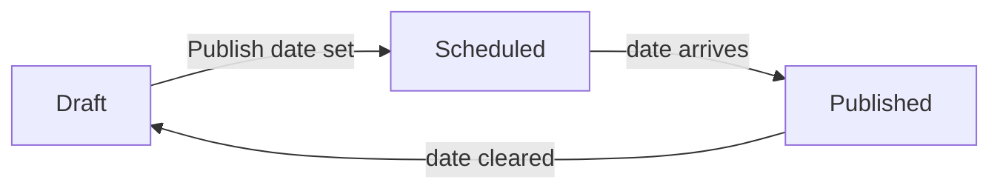

Every part the Blog can render, in one Article: highlighted code, a diagram,
a callout, a table, a quote, a footnote and an image. The renderer tests, the
seed and the visual checks all read this one file.

## Code, in two languages

An Article is mostly code, so the highlighter carries the site's palette
rather than a theme of its own.

```ts
type Ink = "accent" | "muted";

export function label(ink: Ink): string {
  // Keywords take the accent, strings the second accent, this the muted grey.
  return `ink: ${ink}`;
}
```

The same in Python, to prove a second grammar is loaded:

```python
def label(ink: str) -> str:
    """Two grammars, one palette."""
    return f"ink: {ink}"
```

A language nobody imported falls back to plain text, and inline `code` keeps
its box.

## A diagram



## A callout

:::callout{kind="warning"}
Raw HTML in an Article is inert. The tag below is text on the page, never a
script the browser runs.
:::

<script>alert("this is text, not a script")</script>

## A table

| State     | Publish date    | On the site |
| --------- | --------------- | ----------- |
| Draft     | none            | no          |
| Scheduled | in the future   | no          |
| Published | arrived         | yes         |

## A quote, a picture and a footnote

> The best code is the code that is not there.


Prose can hold a time like 10:30 without the directive parser eating it[^1],
and a heading can be linked by the `#` that appears beside it.

[^1]: A footnote, which links back to where it was called.
